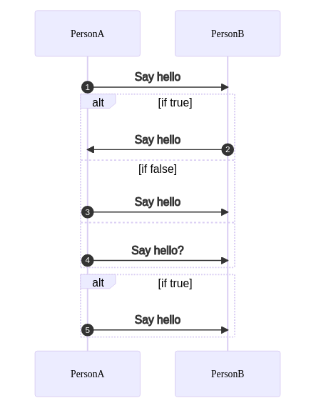
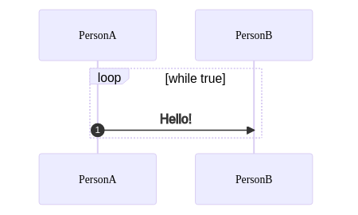

# Mermaid Examples

https://mermaid-js.github.io

- https://mermaid-js.github.io/mermaid/#/examples
- https://www.diagrams.net/blog/mermaid-diagrams

## Sequence

https://mermaid-js.github.io/mermaid/#/sequenceDiagram

### Simple

([source code](./sequence.txt))

### Conditionals

([source code](./sequence-flow-ctrl.txt) | [docs](https://mermaid-js.github.io/mermaid/#/sequenceDiagram?id=alt))

### Loops

([source code](./sequence-loop.txt) | [docs](https://mermaid-js.github.io/mermaid/#/sequenceDiagram?id=loops))

### Note

([source code](./sequence-note.txt) | [docs](https://mermaid-js.github.io/mermaid/#/sequenceDiagram?id=notes))

## Flowchart

https://mermaid-js.github.io/mermaid/#/flowchart

([source code](./flowchart.txt))
