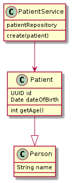
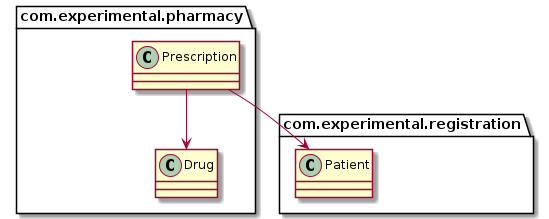
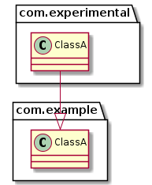
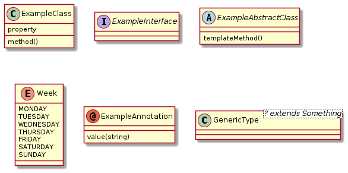

# PlantUML

https://plantuml.com/

## Class diagram

https://plantuml.com/en/class-diagram

### Simple

([source code](./class-diagram-simple.puml))

### Packages

([source code](./class-diagram-packages.puml))

### Namespaces

([source code](./class-diagram-packages.puml))

### Types

([source code](./class-diagram-types.puml))

